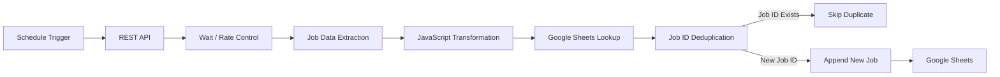
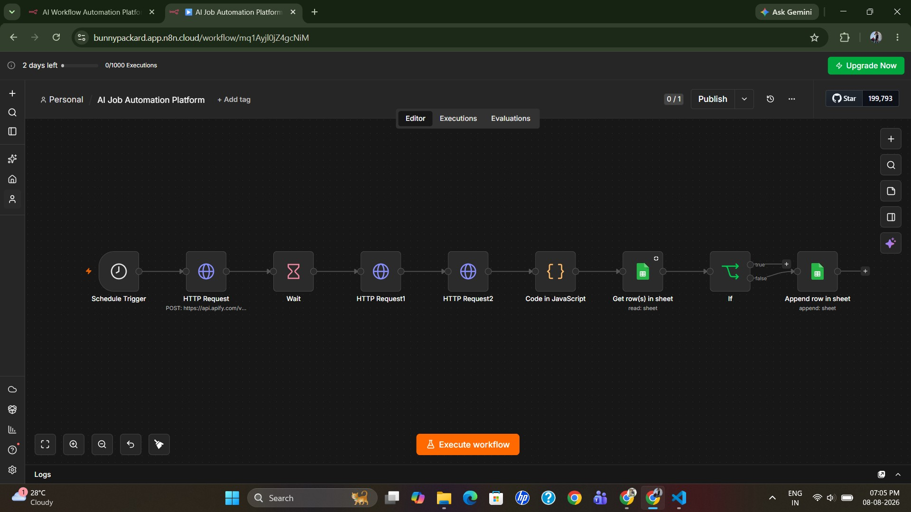
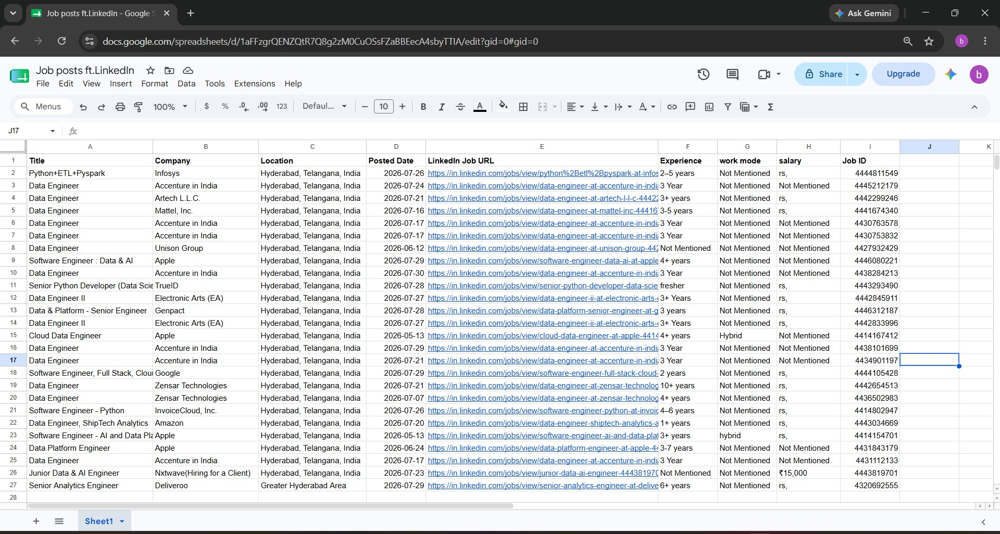

# LinkedIn Job Data Engineering Pipeline

An end-to-end automated data pipeline for ingesting, transforming, validating, deduplicating, and storing job posting data using n8n, REST APIs, JavaScript, and Google Sheets.

## Project Overview

This project automates the collection and processing of job posting data from an external API.

The pipeline performs:

- Scheduled job data ingestion
- API-based data extraction
- Data transformation and standardization
- Job attribute mapping
- Job ID-based duplicate detection
- Conditional data routing
- Incremental loading of new job records
- Storage in Google Sheets

## Architecture


## Workflow Screenshots

### n8n Workflow Overview



### Google Sheets Output



## Technologies

- n8n
- REST API
- JavaScript
- Google Sheets
- JSON
- GitHub

## Data Pipeline

### 1. Data Ingestion

- Schedule Trigger initiates the workflow.
- REST API is called to retrieve job posting data.
- Wait node provides rate control between API requests.

### 2. Data Transformation

JavaScript is used to transform and standardize the API response.

The following attributes are extracted and mapped:

- Job Title
- Company
- Location
- Posted Date
- LinkedIn Job URL
- Experience
- Work Mode
- Salary
- Job ID

### 3. Data Validation

Job attributes are validated and standardized before loading into the target dataset.

### 4. Duplicate Detection

The `Job ID` is used as the unique identifier.

The pipeline checks the existing Google Sheets records:

- **Existing Job ID → Skip record**
- **New Job ID → Continue to loading**

### 5. Incremental Loading

Only new job records are appended to Google Sheets, preventing duplicate records during subsequent pipeline executions.

### 6. Data Storage

Google Sheets is used as the target data store for the processed job posting records.

## Project Structure

```text
linkedin-job-data-pipeline/
│
├── README.md
│
├── workflow/
│   └── linkedin-job-pipeline.json
│
├── docs/
│   └── architecture.md
│
├── workflow-overview.jpg
│
└── google-sheets-output.jpg
```

### Workflow Export

The n8n workflow can be exported as a JSON file and imported into another n8n environment.

The workflow contains:

- Scheduled workflow execution
- REST API integration
- Job data extraction
- JavaScript-based transformation
- Google Sheets lookup
- Job ID-based deduplication
- Conditional routing
- Incremental loading

## Key Data Engineering Concepts

- ETL Pipeline
- API Data Ingestion
- Data Transformation
- Data Validation
- Incremental Loading
- Deduplication
- Unique Key Management
- Workflow Orchestration
- Conditional Processing
- Data Mapping

## Project Outcome

The pipeline reduces manual job data collection and prevents duplicate job records from being inserted into the target dataset.

## Future Enhancements

- Replace Google Sheets with a relational database
- Add SQL-based data storage
- Implement data quality checks
- Add logging and monitoring
- Add failure notifications
- Build a Power BI dashboard
- Deploy the pipeline as a scheduled production workflow
