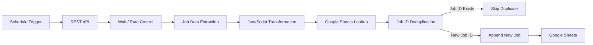

# LinkedIn Job Data Engineering Pipeline

An end-to-end automated data pipeline for ingesting, transforming, validating, deduplicating, and storing job posting data using n8n, REST APIs, JavaScript, and Google Sheets.

## Project Overview

This project automates the collection and processing of job posting data from an external API.

The pipeline performs:

- Scheduled job data ingestion
- API-based data extraction
- Data transformation and standardization
- Job attribute mapping
- Job ID-based duplicate detection
- Conditional data routing
- Incremental loading of new job records
- Storage in Google Sheets

## Architecture

## Technologies

- n8n
- REST API
- JavaScript
- Google Sheets
- JSON
- GitHub

## Data Pipeline

### 1. Data Ingestion

Job posting data is retrieved from an external REST API.

### 2. Data Transformation

JavaScript is used to extract and standardize important attributes such as:

- Job Title
- Company
- Location
- Posted Date
- LinkedIn Job URL
- Experience
- Work Mode
- Salary
- Job ID

### 3. Data Validation

Incoming records are processed before loading them into the target dataset.

### 4. Deduplication

Job ID is used as the unique identifier.

Existing Job IDs are detected using Google Sheets lookup logic.

- Existing Job ID → Skip
- New Job ID → Append

### 5. Data Loading

Validated new job records are incrementally appended to Google Sheets.

## Key Data Engineering Concepts

- ETL Pipeline
- API Data Ingestion
- Data Transformation
- Data Validation
- Incremental Loading
- Deduplication
- Unique Key Management
- Workflow Orchestration
- Conditional Processing
- Data Mapping

## Project Outcome

The pipeline reduces manual job data collection and prevents duplicate job records from being inserted into the target dataset.

## Future Enhancements

- Replace Google Sheets with a relational database
- Add SQL-based data storage
- Implement data quality checks
- Add logging and monitoring
- Add failure notifications
- Build a Power BI dashboard
- Deploy the pipeline as a scheduled production workflow
