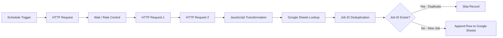

# Pipeline Architecture

## Overview

This project implements an automated job data pipeline using n8n, REST APIs, JavaScript, and Google Sheets.

## Data Flow

## Pipeline Components

### 1. Data Ingestion
Job posting data is extracted from an external REST API through the n8n workflow.

### 2. Data Transformation
JavaScript is used to standardize and map job attributes such as title, company, location, experience, work mode, salary, and Job ID.

### 3. Data Validation
Job attributes are validated and standardized before loading into the target dataset.

### 4. Deduplication
Job ID is used as the unique identifier. Existing Job IDs are skipped to prevent duplicate records.

### 5. Incremental Loading
Only new job records are appended to Google Sheets, preventing duplicate records during subsequent pipeline runs.

### 6. Data Storage
Google Sheets is used as the target data store for processed job posting records.

## Technologies

- n8n
- REST API
- JavaScript
- Google Sheets
- JSON
- GitHub
